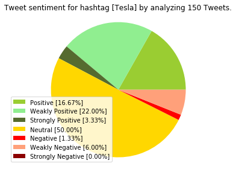
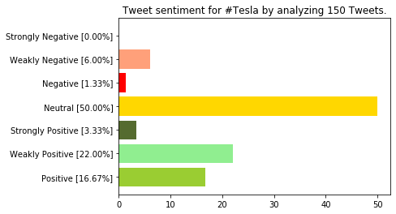
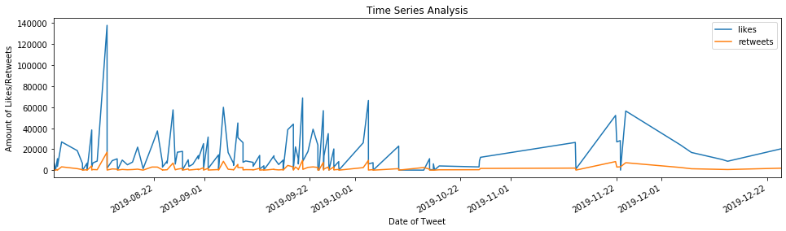
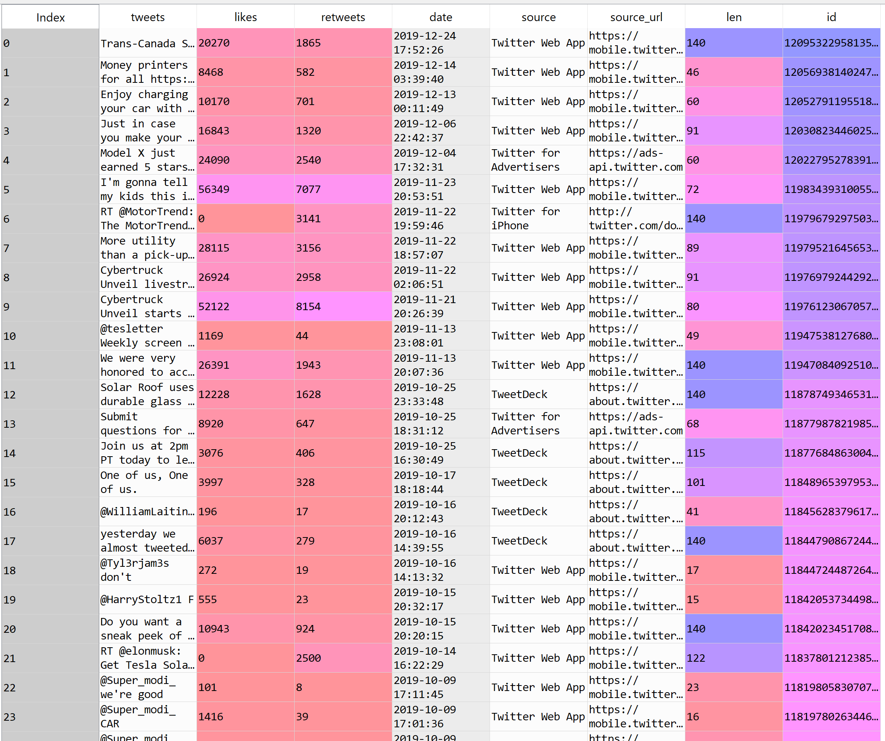

# Twitter-Sentiment-Analysis

Type in a username or hashtag, specify the amount of tweets that you want to include in the sentiment analysis, and view the sentiment by percentage, most liked/retweeted tweets, and a time series analysis of likes/retweets for the username/hashtag. Three dataframes will also be returned that you can use as desired. The one titled 'tweet_df' includes tweet content, # of likes, # of retweets, date posted, source, source url, Tweet length, and Tweet ID. The one titled 'sort_by_likes' contains all of the same information except the tweets are sorted in descending order by number of likes. The one titled 'sort_by_retweets' contains all of the same information as well except the tweets are sorted in descending order by number of retweets. 

### Prerequisites
* Twitter account used to obtain keys/access tokens
  - [How to use the Twitter API - Instructions](https://rapidapi.com/blog/how-to-use-the-twitter-api/)
  
### Libraries to Install
* matplotlib - plotting library for NumPy
* pandas - software library for data manipulation and analysis
* numpy - general-purpose array-processing package

## Running the Program
* Once the program is run, you will be prompted to enter 1 if you wish to search by username, or 2 if you wish to search by hashtag
* Next, enter the username/hashtag that you wish to search for. (If using a username, MAKE SURE you type it in exactly as it appears on
  Twitter, minus the '@' symbol. If using a hashtag, MAKE SURE no spaces appear in the hashtag; it must all be typed as one word.)
* Following, enter the number of tweets you wish to include in the sentiment analysis data-frame.

* Once these steps are complete, the terminal will return the average sentiment, an in-depth analysis of sentiment, color coded pie and bar 
  charts displaying sentiment by percentage, a time series analysis representing the amount of likes and retweets over time, the text of
  the most liked tweet, the text of the most retweeted tweet, and three dataframes. The dataframe titled 'tweet_df' includes tweet       content, # of likes, # of retweets, date posted, source, source url, Tweet length, and Tweet ID. The dataframe titled 'sort_by_likes' contains all of the same information except the tweets are sorted in descending order by number of likes. The dataframe titled 'sort_by_retweets' contains all of the same information as well except the tweets are sorted in descending order by number of retweets.
    
* You can also use the dataframes to view the text of each Tweet, and copy/past the html at the end of it into your browser to view the Tweet from Twitter.

* Feel free to search for more usernames/hashtags, vary the amount of tweets incorperated in the dataframe, and use the dataframes to
  see if you can draw any conclusions from the Tweets!

## Authors

* **William Schmidt** - [LinkedIn](https://www.linkedin.com/in/william-schmidt-152431168/)
